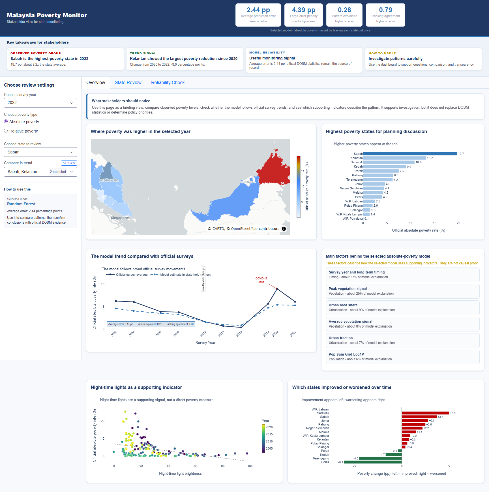
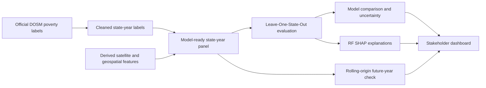

# Malaysia Poverty Monitor

[](https://github.com/AfifFarihin/malaysia-poverty-monitor/actions/workflows/ci.yml)
[](https://www.python.org/)
[](LICENSE)

An interpretable machine-learning study of state-level poverty in Malaysia using official DOSM labels and satellite/geospatial proxy features. The repository includes a leakage-aware evaluation workflow, SHAP explanations, reproducibility checks, and a stakeholder-facing Dash dashboard.



## Project Highlights

- Models 16 Malaysian states and federal territories across 10 official survey years from 2002 to 2022.
- Fits preprocessing inside every Leave-One-State-Out (LOSO) fold so each test fold represents a geographically unseen state without shared imputation statistics.
- Adds a rolling-origin backtest in which every test year is predicted using strictly earlier survey years.
- Compares Random Forest, XGBoost, Ridge, ElasticNet, and year-only baselines.
- Uses SHAP to explain the selected Random Forest without presenting feature importance as causal evidence.
- Preserves source lineage, model metrics, uncertainty intervals, and machine-readable QA artifacts.
- Provides a three-view dashboard for national overview, state review, and model reliability.

## Results

The primary absolute-poverty model is selected by a deterministic rule: only the predeclared sensor-safe feature policy is eligible, then the lowest LOSO MAE wins (with fixed tie-breakers). This excludes nighttime-light fields from the primary model because the retained 2012 NTL value comes from 2013 VIIRS. Full-feature models remain retrospective comparators only.

| Target | Selected model | LOSO MAE | LOSO RMSE | R2 | Spearman |
|---|---|---:|---:|---:|---:|
| Absolute poverty | Sensor-safe Random Forest | 2.443 pp | 4.392 | 0.276 | 0.794 |
| Relative poverty | Year-only XGBoost | 2.236 pp | 2.889 | 0.247 | 0.431 |

For absolute poverty, the selected model improves MAE by 0.518 percentage points over the year-only baseline. Its paired MAE advantage over the full-feature XGBoost comparator is 0.095 pp, but the 2,000-resample state-group interval crosses zero, so the project does not claim decisive superiority. The separate rolling-origin backtest covers 2012-2022 and records MAE 2.656 pp, R2 0.326, and Spearman 0.601. Relative poverty remains a negative result: satellite features do not outperform the year-only baseline.

## Workflow



## Quick Start

Requirements: Python 3.11 and [uv](https://docs.astral.sh/uv/).

```powershell
git clone https://github.com/AfifFarihin/malaysia-poverty-monitor.git
cd malaysia-poverty-monitor
uv sync --extra dashboard --extra notebooks --group dev
uv run python -m dashboard_stakeholder.app
```

Open `http://127.0.0.1:8051`.

To inspect or rerun the notebooks:

```powershell
uv run jupyter lab
```

Run them in order:

1. `notebooks/00_dosm_raw_to_labels.ipynb`
2. `notebooks/01_malaysia_data_preparation.ipynb`
3. `notebooks/02_malaysia_spatial_features.ipynb`
4. `notebooks/03_model_training_evaluation.ipynb`
5. `notebooks/04_dashboard_artifacts.ipynb`

## Repository Layout

```text
config/                  Project paths and Malaysia-specific settings
dashboard_stakeholder/   Dash application and screenshots
data/                    Source labels, derived panel, predictions, boundaries
notebooks/               Ordered analysis and modelling workflow
outputs/                 Figures, metrics, and QA evidence
setup/                   Detailed run and optional extraction guidance
tests/                   Data-contract and dashboard smoke tests
```

## Validation

```powershell
uv run ruff check dashboard_stakeholder scripts tests
uv run pytest -q
uv run python scripts/run_notebooks.py
```

The CI workflow executes the complete notebook pipeline, then runs the same checks on every push and pull request.

## Data Provenance

- Poverty labels: [OpenDOSM `hh_poverty_state`](https://open.dosm.gov.my/data-catalogue/hh_poverty_state), CC BY 4.0.
- Administrative boundaries: [geoBoundaries `gbOpen` MYS ADM1](https://www.geoboundaries.org/api/current/gbOpen/MYS/ADM1/), ODbL 1.0, based on OpenStreetMap/Wambacher data.
- Satellite/geospatial columns are retained state-level aggregates derived from nighttime lights, vegetation, land cover, population, and terrain sources. Raw raster exports are not redistributed.

See [DATA_LICENSES.md](DATA_LICENSES.md), [DATA_DICTIONARY.md](DATA_DICTIONARY.md), and [source provenance notes](data/provenance/source_provenance_notes.md) for details. The MIT license applies to repository code and documentation, not automatically to third-party data.

## Limitations and Responsible Use

- The panel is small: 16 states and 157 observed absolute-poverty state-years.
- The analysis is observational. SHAP values and correlations describe model behavior, not causal effects.
- Satellite sensor changes and source-year substitutions can introduce measurement discontinuities.
- The 2012 nighttime-light value uses 2013 VIIRS and is excluded from the primary sensor-safe model; models using it are retrospective comparisons only.
- The repository retains the final state-level feature panel; it does not provide a fully automated rebuild from raw raster imagery.
- The dashboard is a monitoring and research aid, not a replacement for official DOSM releases or local needs assessment.

## Author

Developed by [AfifFarihin](https://github.com/AfifFarihin) as a final-year data analytics project, then repackaged as a reproducible public portfolio repository.

## License

Code and original documentation are released under the [MIT License](LICENSE). Third-party data retain their original terms as documented in [DATA_LICENSES.md](DATA_LICENSES.md).
